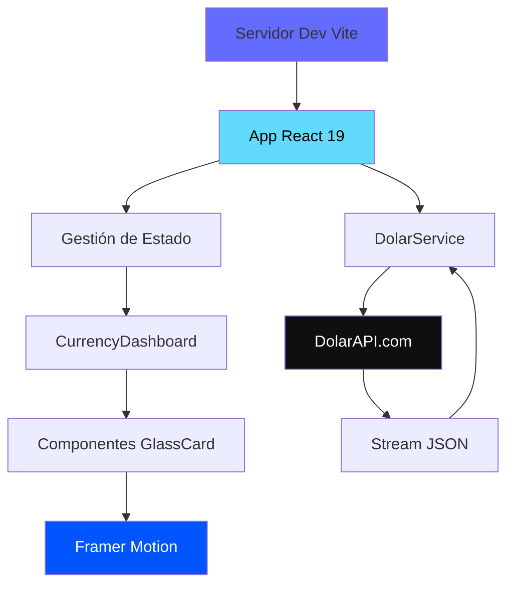

[English](./README.md) | [Español](./README.es.md) | [Português](./README.pt.md)

# Dolar API Dashboard

Dashboard de tasas de cambio venezolanas en tiempo real con sistema de diseño glassmorphism.

## Descripción General

Esta aplicación proporciona una interfaz visual para rastrear las tasas de cambio de moneda venezolana en tiempo real. Se conecta al servicio DolarAPI para mostrar tasas actuales de múltiples pares de divisas, incluyendo tasas del mercado paralelo (dólar paralelo) y tasas de cambio oficiales.

El dashboard implementa un sistema de diseño glassmorphism optimizado para rendimiento en pantallas de alta resolución. En lugar de usar filtros de desenfoque estándar que pueden causar caídas de frames en pantallas retina, la interfaz usa un enfoque de "vidrio sólido" con texturas de ruido e iluminación interna para crear profundidad sin comprometer el rendimiento.

Construida con React 19 y Vite, la aplicación prioriza tiempos de carga rápidos e interacciones suaves mediante atención cuidadosa a la física de animación y estabilidad del layout.

## Arquitectura



## Características

### Datos en Tiempo Real

- **Tasas de Cambio en Vivo**: Auto-actualización cada 60 segundos
- **Múltiples Pares de Divisas**: Mercado paralelo, tasas oficiales y crypto
- **Tendencias Históricas**: Indicadores visuales para cambios de tasa
- **Cero Desplazamiento de Layout**: Loaders skeleton coinciden con geometría del componente final

### Sistema de Diseño

- **Glassmorphism**: UI translúcida con profundidad y jerarquía
- **Modo Oscuro**: Paleta de alto contraste basada en `#050505`
- **Física de Resorte**: Animaciones Framer Motion con rigidez: 300
- **Texturas de Ruido**: Grano sutil (opacidad: 0.05) para textura tipo papel
- **Optimizado para Rendimiento**: Sin desenfoque de fondo para prevenir throttling térmico

### Experiencia de Usuario

- **Elevación Magnética**: Componentes responden al hover antes del clic
- **Feedback Táctil**: Micro-interacciones visuales para todas las acciones
- **Responsivo**: Se adapta a todos los tamaños de pantalla
- **Accesible**: HTML semántico y etiquetas ARIA

## Stack Tecnológico


**Core**:

- [React 19](https://react.dev/) - Biblioteca de componentes UI
- [TypeScript](https://www.typescriptlang.org/) - Desarrollo type-safe
- [Vite](https://vitejs.dev/) - Herramienta de build y servidor dev

**Estilos**:

- [Tailwind CSS](https://tailwindcss.com/) - Framework CSS utility-first
- [Framer Motion](https://www.framer.com/motion/) - Biblioteca de animaciones
- [Lucide React](https://lucide.dev/) - Sistema de iconos

**Datos**:

- [DolarAPI](https://dolarapi.com/) - API de tasas de cambio venezolanas
- [date-fns](https://date-fns.org/) - Utilidades de formato de fecha

## Primeros Pasos

### Prerequisitos

- Node.js 18 o superior
- Gestor de paquetes npm

### Instalación

1. **Clonar el repositorio**:

```bash
git clone https://github.com/LuisSambrano/dolar-api.git
cd dolar-api
```

2. **Instalar dependencias**:

```bash
npm install
```

3. **Ejecutar el servidor de desarrollo**:

```bash
npm run dev
```

4. **Abrir la aplicación**:

Navega a [http://localhost:5173](http://localhost:5173) en tu navegador.

### Comandos de Desarrollo

```bash
npm run dev          # Iniciar servidor de desarrollo Vite
npm run build        # Construir para producción
npm run preview      # Vista previa de build de producción
npm run lint         # Ejecutar verificaciones ESLint
```

## Estructura del Proyecto

```
src/
├── components/
│   ├── ui/                 # Componentes UI reutilizables
│   │   └── GlassCard.tsx  # Componente base de vidrio
│   └── CurrencyDashboard.tsx
├── services/
│   └── dolarService.ts    # Cliente API
├── types/
│   └── currency.ts        # Definiciones TypeScript
├── App.tsx                # Componente raíz
└── main.tsx               # Punto de entrada de aplicación
```

## Personalización

### Física del Vidrio

El efecto glassmorphism puede personalizarse en `src/components/ui/GlassCard.tsx`:

```typescript
const SPRING_TRANSITION = {
  type: "spring",
  stiffness: 300, // Mayor = más snap
  damping: 30, // Menor = más rebote
  mass: 1,
};
```

### Paleta de Colores

La paleta de modo oscuro está definida en `tailwind.config.ts`:

```typescript
colors: {
  background: '#050505',
  foreground: '#FFFFFF',
  // ... otros colores semánticos
}
```

## Integración API

La aplicación usa el servicio público DolarAPI:

- **Endpoint**: `https://dolarapi.com/v1/dolares`
- **Límite de Tasa**: No requiere autenticación para uso básico
- **Frecuencia de Actualización**: Los datos se refrescan cada 60 segundos

## Contribuir

Las contribuciones son bienvenidas. Por favor sigue estas pautas:

1. Haz fork del repositorio
2. Crea una rama de feature: `git checkout -b feature/descripcion`
3. Realiza tus cambios con commits claros y atómicos
4. Ejecuta linting: `npm run lint`
5. Push a tu fork: `git push origin feature/descripcion`
6. Envía un pull request

### Convención de Commits

Este proyecto sigue [Conventional Commits](https://www.conventionalcommits.org/):

- `feat`: Nueva característica
- `fix`: Corrección de bug
- `refactor`: Refactorización de código
- `style`: Cambios de estilo de código
- `docs`: Actualizaciones de documentación
- `test`: Adiciones o modificaciones de tests
- `chore`: Tareas de mantenimiento

Ejemplo: `feat(dashboard): agregar gráfico de tasas históricas`

## Licencia

Licencia MIT - Ver [LICENSE](LICENSE) para detalles.

## 🔬 Investigación y Registro de Decisiones

Este sistema de visualización sigue el protocolo **Research-First**.

| Documento                                     | Propósito                                                   |
| --------------------------------------------- | ----------------------------------------------------------- |
| [KEY_FINDINGS.md](./research/KEY_FINDINGS.md) | Decisiones de Arquitectura y UX (Glassmorphism, Zero-Shift) |
| [prompts/](./research/prompts/)               | Tracking de investigación de optimización                   |

> **Decisiones de Diseño**: Lee `KEY_FINDINGS.md` para entender la racional detrás de la técnica "Solid Glass".

## Enlaces

- **Repositorio**: [github.com/LuisSambrano/dolar-api](https://github.com/LuisSambrano/dolar-api)
- **Autor**: [Luis Sambrano](https://github.com/LuisSambrano)
- **Documentación API**: [dolarapi.com](https://dolarapi.com/)

---

[English](./README.md) | **Español**
