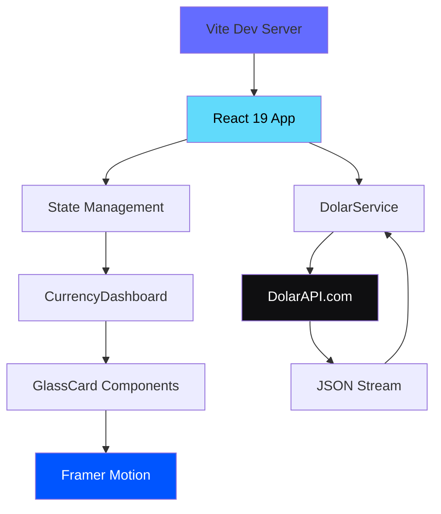

[English](./README.md) | [Español](./README.es.md) | [Português](./README.pt.md)

# Dolar API Dashboard

Real-time Venezuelan exchange rate dashboard with glassmorphism design system.

<!-- CTAs -->
<p align="center">
  <a href="https://github.com/LuisSambrano/dolar-api/stargazers"></a>
  <a href="https://github.com/LuisSambrano/dolar-api/network/members"></a>
  <a href="https://github.com/LuisSambrano/dolar-api/issues"></a>
  <a href="https://github.com/LuisSambrano/dolar-api/blob/main/LICENSE"></a>
</p>

## Overview

This application provides a visual interface for tracking Venezuelan currency exchange rates in real-time. It connects to the DolarAPI service to display current rates for multiple currency pairs, including parallel market rates (dólar paralelo) and official exchange rates.

The dashboard implements a glassmorphism design system optimized for performance on high-resolution displays. Rather than using standard backdrop blur filters that can cause frame drops on retina screens, the interface uses a "solid glass" approach with noise textures and inner lighting to create depth without compromising performance.

Built with React 19 and Vite, the application prioritizes fast load times and smooth interactions through careful attention to animation physics and layout stability.

## Architecture



## Features

### Real-Time Data

- **Live Exchange Rates**: Auto-refresh every 60 seconds
- **Multiple Currency Pairs**: Parallel market, official rates, and crypto
- **Historical Trends**: Visual indicators for rate changes
- **Zero Layout Shift**: Skeleton loaders match final component geometry

### Design System

- **Glassmorphism**: Translucent UI with depth and hierarchy
- **Dark Mode**: High-contrast palette based on `#050505`
- **Spring Physics**: Framer Motion animations with stiffness: 300
- **Noise Textures**: Subtle grain (opacity: 0.05) for paper-like texture
- **Performance Optimized**: No backdrop blur to prevent thermal throttling

### User Experience

- **Magnetic Lift**: Components respond to hover before click
- **Tactile Feedback**: Visual micro-interactions for all actions
- **Responsive**: Adapts to all screen sizes
- **Accessible**: Semantic HTML and ARIA labels

## Tech Stack


**Core**:

- [React 19](https://react.dev/) - UI component library
- [TypeScript](https://www.typescriptlang.org/) - Type-safe development
- [Vite](https://vitejs.dev/) - Build tool and dev server

**Styling**:

- [Tailwind CSS](https://tailwindcss.com/) - Utility-first CSS framework
- [Framer Motion](https://www.framer.com/motion/) - Animation library
- [Lucide React](https://lucide.dev/) - Icon system

**Data**:

- [DolarAPI](https://dolarapi.com/) - Venezuelan exchange rate API
- [date-fns](https://date-fns.org/) - Date formatting utilities

## Getting Started

### Prerequisites

- Node.js 18 or higher
- npm package manager

### Installation

1. **Clone the repository**:

```bash
git clone https://github.com/LuisSambrano/dolar-api.git
cd dolar-api
```

2. **Install dependencies**:

```bash
npm install
```

3. **Run the development server**:

```bash
npm run dev
```

4. **Open the application**:

Navigate to [http://localhost:5173](http://localhost:5173) in your browser.

### Development Commands

```bash
npm run dev          # Start Vite development server
npm run build        # Build for production
npm run preview      # Preview production build
npm run lint         # Run ESLint checks
```

## Project Structure

```
src/
├── components/
│   ├── ui/                 # Reusable UI components
│   │   └── GlassCard.tsx  # Base glass component
│   └── CurrencyDashboard.tsx
├── services/
│   └── dolarService.ts    # API client
├── types/
│   └── currency.ts        # TypeScript definitions
├── App.tsx                # Root component
└── main.tsx               # Application entry point
```

## Customization

### Glass Physics

The glassmorphism effect can be customized in `src/components/ui/GlassCard.tsx`:

```typescript
const SPRING_TRANSITION = {
  type: "spring",
  stiffness: 300, // Higher = more snap
  damping: 30, // Lower = more bounce
  mass: 1,
};
```

### Color Palette

The dark mode palette is defined in `tailwind.config.ts`:

```typescript
colors: {
  background: '#050505',
  foreground: '#FFFFFF',
  // ... other semantic colors
}
```

## API Integration

The application uses the public DolarAPI service:

- **Endpoint**: `https://dolarapi.com/v1/dolares`
- **Rate Limit**: No authentication required for basic usage
- **Update Frequency**: Data refreshes every 60 seconds

## Contributing

Contributions are welcome. Please follow these guidelines:

1. Fork the repository
2. Create a feature branch: `git checkout -b feature/description`
3. Make your changes with clear, atomic commits
4. Run linting: `npm run lint`
5. Push to your fork: `git push origin feature/description`
6. Submit a pull request

### Commit Convention

This project follows [Conventional Commits](https://www.conventionalcommits.org/):

- `feat`: New feature
- `fix`: Bug fix
- `refactor`: Code refactoring
- `style`: Code style changes
- `docs`: Documentation updates
- `test`: Test additions or modifications
- `chore`: Maintenance tasks

Example: `feat(dashboard): add historical rate chart`

## License

MIT License - See [LICENSE](LICENSE) for details.

## Links

- **Repository**: [github.com/LuisSambrano/dolar-api](https://github.com/LuisSambrano/dolar-api)
- **Author**: [Luis Sambrano](https://github.com/LuisSambrano)
- **API Documentation**: [dolarapi.com](https://dolarapi.com/)

---

**[Español](./README.es.md)** | English
