# Dolar API (Luxury Edition) 💎

> **System Core Architecture** | **Glassmorphism 2.0**

A "Unicorn-Tier" financial intelligence dashboard, exploring the convergence of Real-time Data and Quiet Luxury UX.

>)

<!-- ⚠️ REPLACE THE LINK ABOVE WITH A REAL SCREENSHOT OF YOUR APP running on localhost -->

<div align="center">


</div>

---

## 🧭 The Philosophy ("Why Solid Glass?")

We rejected the industry-standard `backdrop-filter: blur()` for a critical engineering reason: **Thermal Throttling on Retina Displays.**

High-resolution screens struggle with real-time blur calculations, causing frame drops (jank) during scrolling. This project implements a **"Solid Glass"** architecture:

1.  **Noise Textures**: We use a subtle grain (`opacity: 0.05`) to emulate the texture of high-end paper.
2.  **Inner Lighting**: Depth is simulated via `box-shadow: inset`, not opacity layers.
3.  **Spring Topology**: All interactive elements follow a specific spring physics model (`stiffness: 300`) to mimic the resistance of physical objects.

---

## 🧬 Architecture Flow

The system acts as a high-performance visual layer over raw financial data.

```mermaid
graph TD
    API[☁️ DolarAPI.com] -->|JSON Stream| Service[🔌 DolarService]
    Service -->|Typed Data| Store[React State]

    subgraph "Glass Engine (UI)"
        Store -->|State Prop| Dashboard[CurrencyDashboard]
        Dashboard -->|Spring Physics| Atom[GlassCard Atom]
        Atom -->|Render| DOM[Virtual DOM]
    end

    style API fill:#0F0F11,stroke:#333,color:#fff
    style Service fill:#18181B,stroke:#333,color:#fff
    style Store fill:#27272A,stroke:#333,color:#fff
    style Dashboard fill:#050505,stroke:#fff,stroke-width:2px,color:#fff
```



---

## ⚡ Features

- **Deep Space Palette**: A semantic color system designed for high-contrast, premium dark modes using `#050505` base.
- **Live Financial Data**: Real-time connections to `dolarapi.com` with auto-refresh (60s interval).
- **Tactile Feedback**: Components "wake up" (Magnetic Lift) before you even click, using `framer-motion` gesture detection.
- **Zero-Layout Shift**: Skeleton loaders share the exact geometry of the final component.

---

## 🚀 Integration & Usage

Designed to be cloned and deployed in under 2 minutes.

### 1. Installation

```bash
# Clone the repository
git clone https://github.com/LuisSambrano/dolar-api.git

# Install dependencies (Node 18+)
npm install
```

### 2. Development

```bash
# Start the Vite development server
npm run dev
```

### 3. Production Build

```bash
# Generate type-safe production assets
npm run build
```

---

## 💎 Customization API

The system is built on **Atomic Design**. You can modify the "Glass Physics" globally in `src/components/ui/GlassCard.tsx`:

```typescript
// Adjust the 'feel' of the application here
const SPRING_TRANSITION = {
  type: "spring",
  stiffness: 300, // Higher = More "Snap"
  damping: 30, // Lower = More "Bounce"
  mass: 1,
};
```

---

## 🤝 Contributing

We follow **Conventional Commits** and strict TypeScript validation. Please see [CONTRIBUTING.md](./CONTRIBUTING.md) for the "Quiet Luxury" code standards.

## 📄 License

This project is open-source under the **MIT License**. You are free to use, modify, and distribute this architecture in your own commercial or private projects. See [LICENSE](./LICENSE).

---

<p align="center">
  <strong>Built for the future.</strong><br>
  <a href="mailto:luissambranoarg@gmail.com">Looking for a System Architect? Let's talk.</a>
</p>
