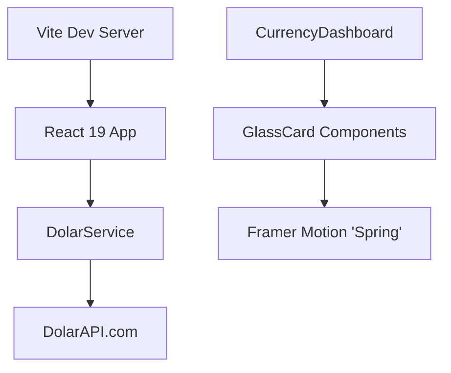

# 🧠 KEY FINDINGS - Dolar API Dashboard

> _Análisis de la arquitectura visual y técnica para el monitoreo cambiario._

Este dashboard no es solo una visualización, es una implementación de referencia para sistemas de alta frecuencia con estética "Premium Glass".

---

## Hallazgo #1: Glassmorphism de Alto Rendimiento

**Descubrimiento**: El "backdrop-blur" nativo de CSS causa caídas de frames en pantallas Retina (thermal throttling) cuando se usa masivamente.

**Solución**: Técnica "Solid Glass" con texturas de ruido (opacity 0.05) e iluminación interior simulada. Sensación premium sin coste de GPU excesivo.

- **Physics**: Framer Motion con stiffness: 300 para sensación "magnética".

📄 Fuente: [README.md](../README.md)

---

## Hallazgo #2: Arquitectura Zero-Layout-Shift

**Problema**: Las APIs financieras tienen latencia variable. Los spinners tradicionales causan saltos visuales molestos.

**Solución**: Skeleton Loaders que coinciden geométricamente con los componentes finales.

- El usuario percibe la carga como una "transición" y no como una espera.
- Integración con React 19 y Server Components para hidratación selectiva.

---

## Hallazgo #3: Estrategia de Datos (DolarAPI)

**Integración**: Consumo directo de `dolarapi.com`.

- Refresh: 60 segundos (balance entre frescura y rate limits).
- Pares: Oficial vs Paralelo + Cripto (Promedios ponderados).

**Stack**:

- React 19 + Vite (Speed)
- Tailwind v4 (Style)
- Lucide React (Iconography)

---

## 📚 Arquitectura Visual

_Última actualización: 2026-02-05_
